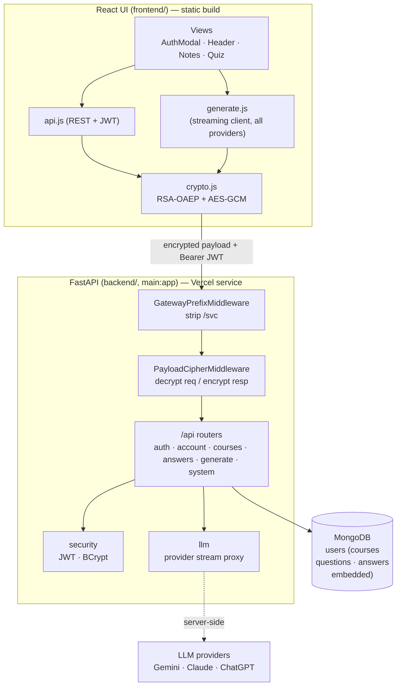
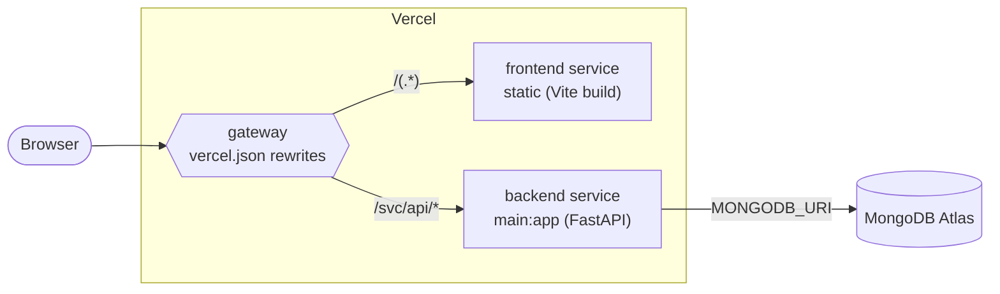
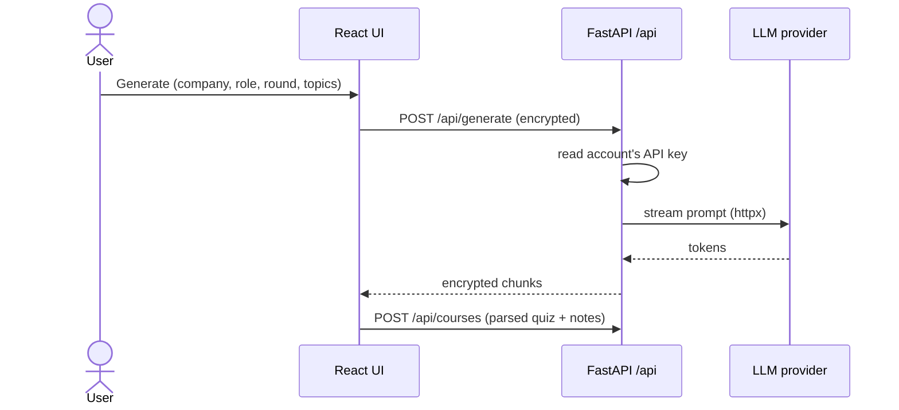
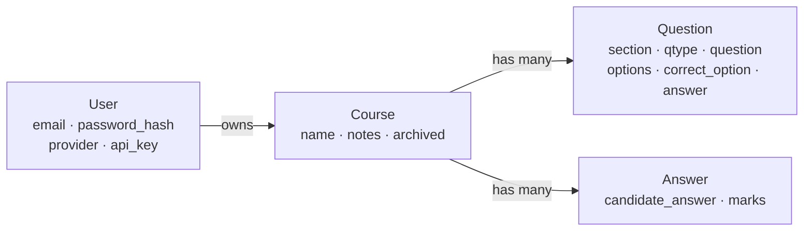

# Architecture

React UI + Python **FastAPI** API, deployed as **two Vercel services** (a static
`frontend/` and a `backend/` ASGI app). Data is stored in **MongoDB** (shared across
instances); `MONGODB_URI` is required. Diagrams are Mermaid.

## Components



- The UI encrypts every `/api` body and decrypts every response ([crypto.js](../frontend/src/crypto.js));
  the server does the inverse in an ASGI middleware ([PayloadCipherMiddleware](../backend/crypto.py)),
  so routers see plain JSON.
- Generation is **proxied** server-side (`/api/generate`) using the account's key —
  the key never reaches the browser.
- The frontend calls `/svc/api/*`; the gateway forwards to the backend, whose
  `GatewayPrefixMiddleware` strips `/svc` so routes stay canonical under `/api`.

## Deployment (Vercel — two services)



- `vercel.json` defines a `frontend/` service and a `backend/` service; the gateway
  routes `/svc/api/*` to the backend and everything else to the frontend.
- The backend is stateless — all data lives in **MongoDB** (`MONGODB_URI`), so any
  instance serves any request. `JWT_SECRET` / `RSA_PRIVATE_KEY` use stable defaults
  (override in prod) so tokens and the transport keypair work across instances too.

## Flow: encrypted transport (every /api call)

```mermaid
sequenceDiagram
  participant UI as React UI
  participant API as FastAPI /api
  Note over UI,API: once, cached
  UI->>API: GET /api/crypto/public-key
  API-->>UI: RSA public key (SPKI)
  Note over UI,API: per request
  UI->>UI: random AES key + IV; RSA-wrap key → X-Enc-Key; AES-GCM body
  UI->>API: request (header + encrypted body {iv, d})
  API->>API: RSA-unwrap key, AES-GCM decrypt, JWT check, handle
  API-->>UI: AES-GCM response (same key), X-Enc: 1
  UI->>UI: decrypt → JSON
```

Without Web Crypto (non-secure context) the UI sends plaintext and the server
passes it through — so it still works over plain HTTP, just unencrypted.
`/api/generate` reuses the AES key to encrypt each streamed chunk as
`base64(iv ‖ ciphertext)\n`.

## Flow: generate



## Data model

Every record is scoped to a user. Each user is one MongoDB document with courses
(and their questions/answers) embedded; see [store.py](../backend/store.py).


