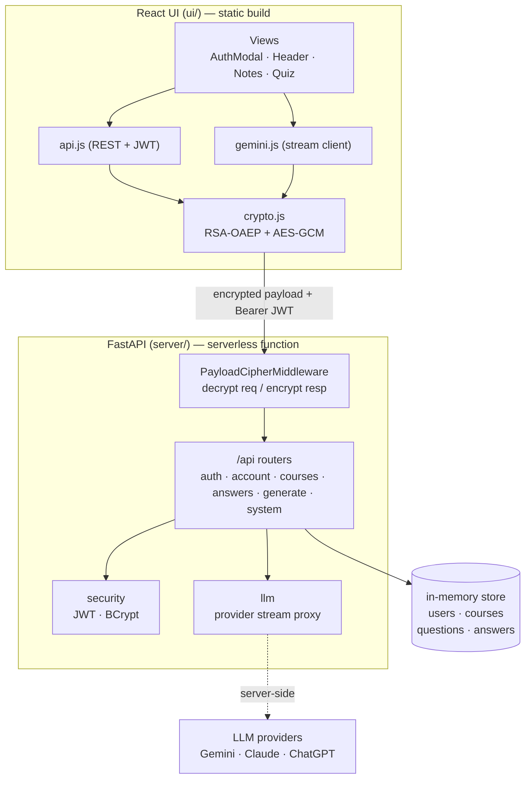
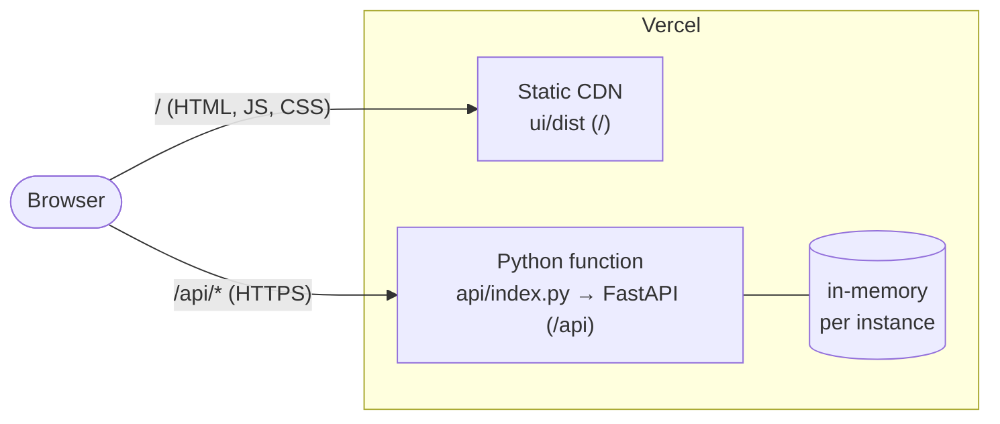
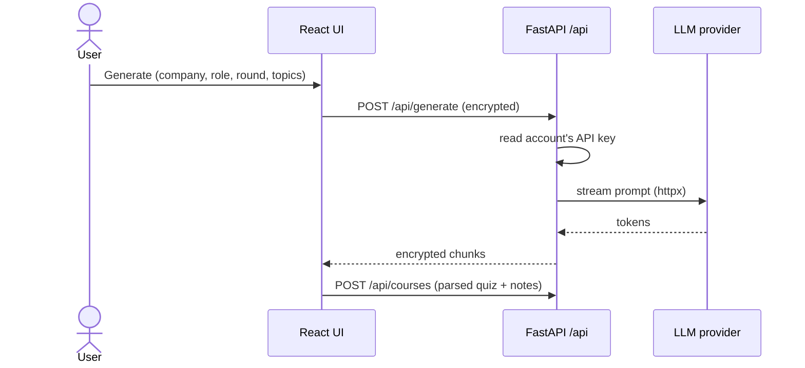
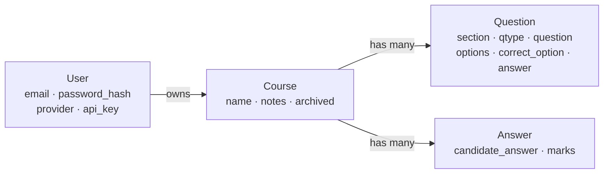

# Architecture

React UI + Python **FastAPI** API. The UI ships as a static build; the API runs as
a **Vercel serverless function**. **In-memory** store (POC — no persistence).
Diagrams are Mermaid (render on GitHub).

## Components



- The UI encrypts every `/api` body and decrypts every response ([crypto.js](../ui/src/crypto.js));
  the server does the inverse in an ASGI middleware ([PayloadCipherMiddleware](../server/crypto.py)),
  so routers see plain JSON.
- Generation is **proxied** server-side (`/api/generate`) using the account's key —
  the key never reaches the browser.
- Same origin on Vercel: the static UI is served at `/` and the function at `/api`,
  so no CORS in production.

## Deployment (Vercel — static UI + serverless API)



- `vercel.json` builds `ui/dist` (static) and deploys `api/index.py` (Python). The
  rewrite `/api/(.*) → /api/index` routes API calls to the function.
- No container, no database. The store lives in the function's memory. **Cold start
  or redeploy = data gone**, and each instance has its own copy — set `JWT_SECRET`
  (and ideally `RSA_PRIVATE_KEY`) so tokens and the transport keypair are stable
  across instances.

## Flow: encrypted transport (every /api call)

```mermaid
sequenceDiagram
  participant UI as React UI
  participant API as FastAPI /api
  Note over UI,API: once, cached
  UI->>API: GET /api/crypto/public-key
  API-->>UI: RSA public key (SPKI)
  Note over UI,API: per request
  UI->>UI: random AES key + IV; RSA-wrap key → X-Enc-Key; AES-GCM body
  UI->>API: request (header + encrypted body {iv, d})
  API->>API: RSA-unwrap key, AES-GCM decrypt, JWT check, handle
  API-->>UI: AES-GCM response (same key), X-Enc: 1
  UI->>UI: decrypt → JSON
```

Without Web Crypto (non-secure context) the UI sends plaintext and the server
passes it through — so it still works over plain HTTP, just unencrypted.
`/api/generate` reuses the AES key to encrypt each streamed chunk as
`base64(iv ‖ ciphertext)\n`.

## Flow: generate



## Data model

Every record is scoped to a user; all in-memory (dataclasses in [store.py](../server/store.py)).


