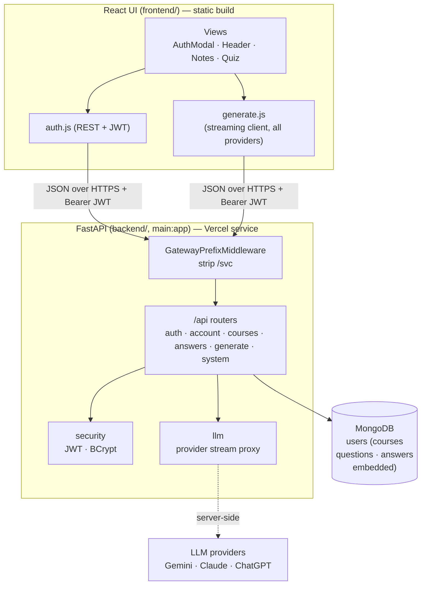
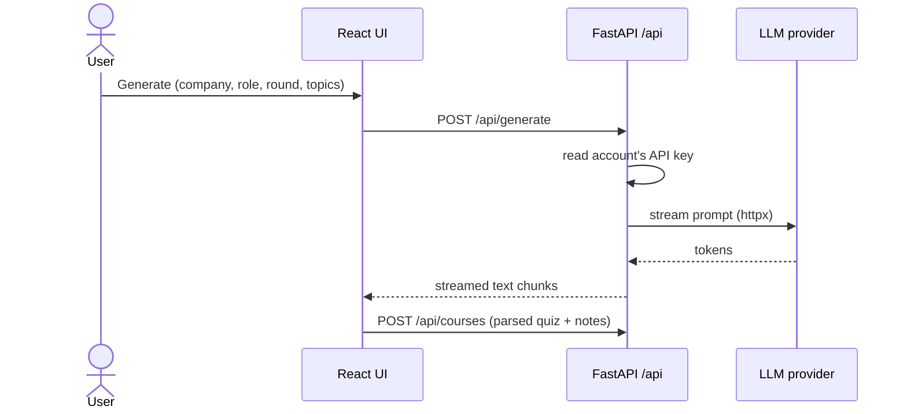
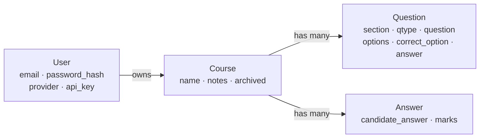

# Architecture

React UI + Python **FastAPI** API, deployed as **two Vercel services** (a static
`frontend/` and a `backend/` ASGI app). Data is stored in **MongoDB** (shared across
instances); `MONGODB_URI` is required. Diagrams are Mermaid.

## Components

- Requests and responses are plain JSON over **HTTPS/TLS**; confidentiality in
  transit is provided by the transport (Vercel terminates TLS for both services).
- Generation is **proxied** server-side (`/api/generate`) using the account's key —
  the key never reaches the browser.
- The frontend calls `/svc/api/*`; the gateway forwards to the backend, whose
  `GatewayPrefixMiddleware` strips `/svc` so routes stay canonical under `/api`.

## Deployment (Vercel — two services)

- `vercel.json` defines a `frontend/` service and a `backend/` service; the gateway
  routes `/svc/api/*` to the backend and everything else to the frontend.
- The backend is stateless — all data lives in **MongoDB** (`MONGODB_URI`), so any
  instance serves any request. `JWT_SECRET` uses a stable default (override in prod)
  so tokens work across instances too.

## Flow: generate

## Data model

Every record is scoped to a user. Each user is one MongoDB document with courses
(and their questions/answers) embedded; see [store.py](../backend/store.py).

