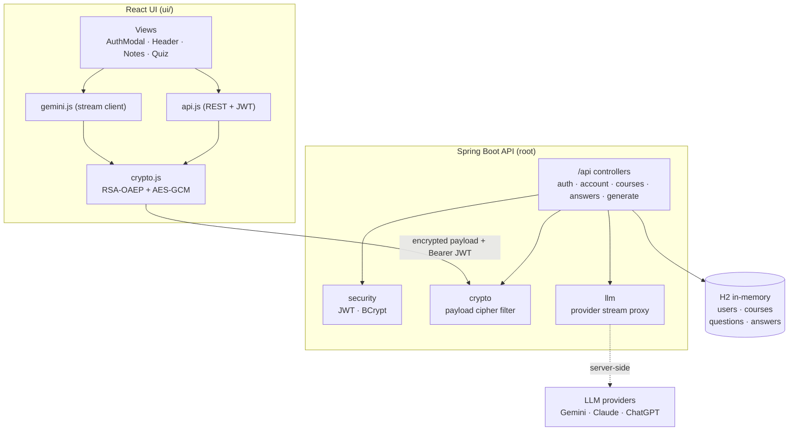
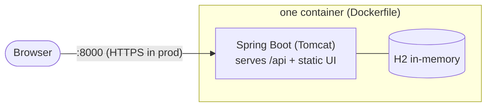
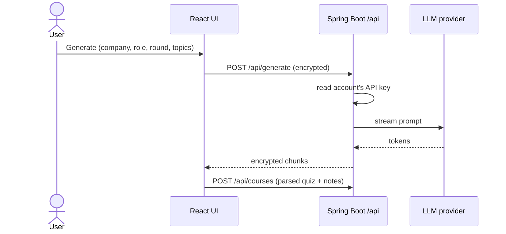
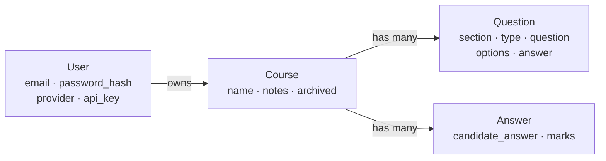

# Architecture

React UI + Spring Boot (Java 21) API, packaged as one container. **In-memory H2**
(POC — no persistence). Diagrams are Mermaid (render on GitHub).

## Components



- The UI encrypts every `/api` body and decrypts every response ([crypto.js](../ui/src/crypto.js));
  the server does the inverse in a filter ([PayloadCipherFilter](../src/main/java/com/interviewprep/crypto/PayloadCipherFilter.java)),
  so controllers see plain JSON.
- Generation is **proxied** server-side (`/api/generate`) using the account's key —
  the key never reaches the browser.
- Same origin in the container: Spring Boot serves the built UI at `/` and the API at
  `/api`, so no CORS.

## Deployment (single container)



- Multi-stage build: Node builds `ui/dist` → Zulu JDK builds the jar → Zulu JRE runs
  it with the UI copied to `static/`.
- No database container, no volumes — H2 lives in the JVM. **Restart = data gone.**
- The JVM starts with non-blocking entropy (`-Djava.security.egd=file:/dev/./urandom`)
  and cold-start flags (`-XX:TieredStopAtLevel=1 -XX:+UseSerialGC`) so it binds the
  port in ~5s — inside Vercel's 15s container-startup limit. Without the entropy flag,
  RSA/JWT key generation can stall on `/dev/random` and miss the window.

## Flow: encrypted transport (every /api call)

```mermaid
sequenceDiagram
  participant UI as React UI
  participant API as Spring Boot /api
  Note over UI,API: once, cached
  UI->>API: GET /api/crypto/public-key
  API-->>UI: RSA public key
  Note over UI,API: per request
  UI->>UI: random AES key + IV; RSA-wrap key → X-Enc-Key; AES-GCM body
  UI->>API: request (header + encrypted body)
  API->>API: RSA-unwrap key, AES-GCM decrypt, JWT check, handle
  API-->>UI: AES-GCM response (same key)
  UI->>UI: decrypt → JSON
```

Without Web Crypto (non-secure context) the UI sends plaintext and the server passes
it through — so it still works over plain HTTP, just unencrypted. `/generate` reuses
the AES key to encrypt each streamed chunk.

## Flow: generate



## Data model

Every record scoped to a user; all in-memory.


