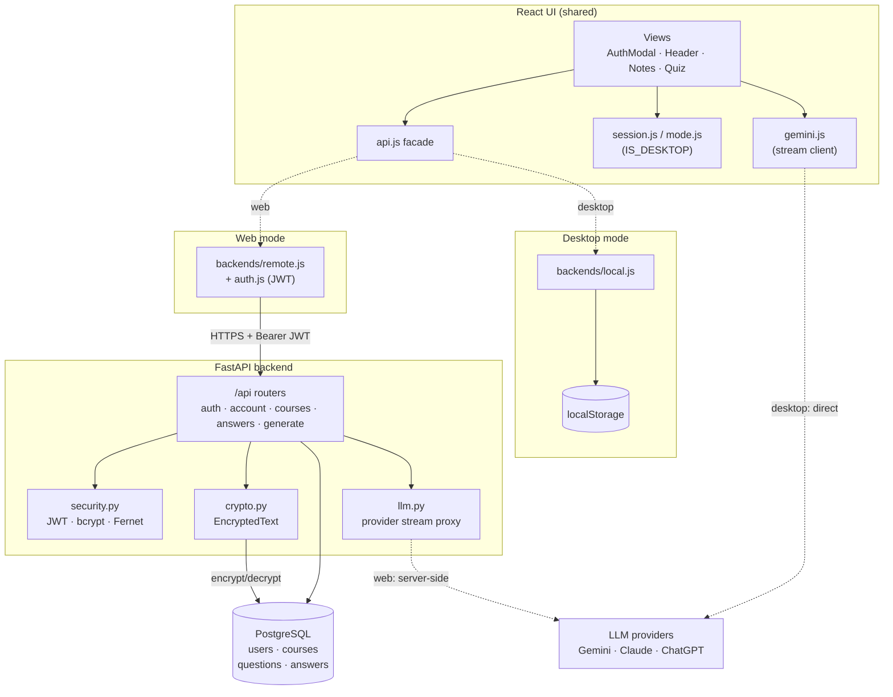
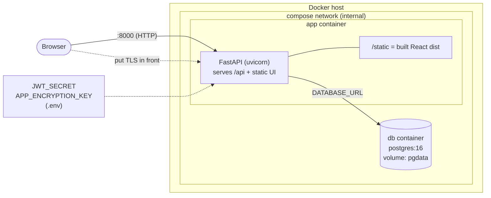
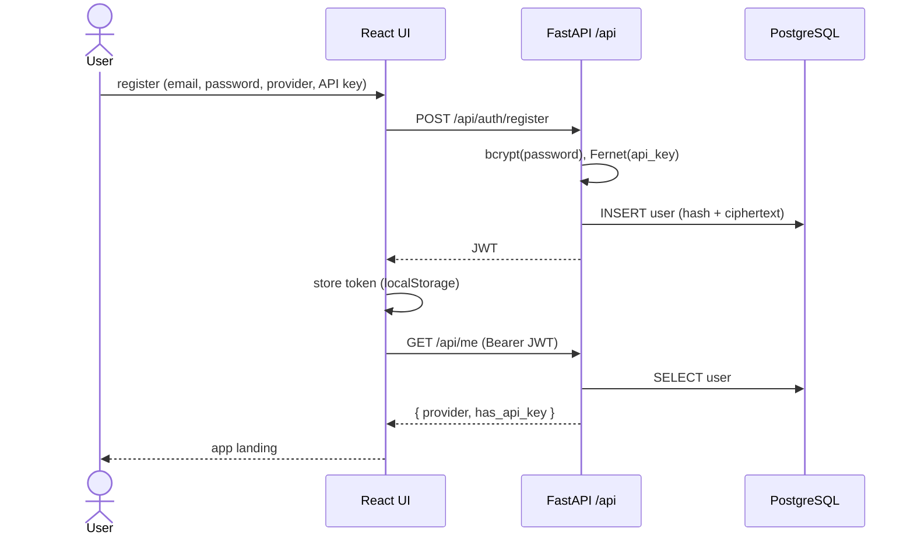
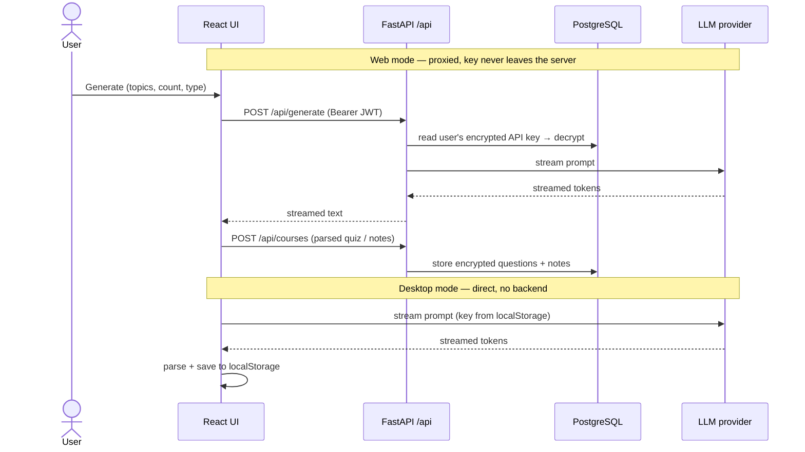
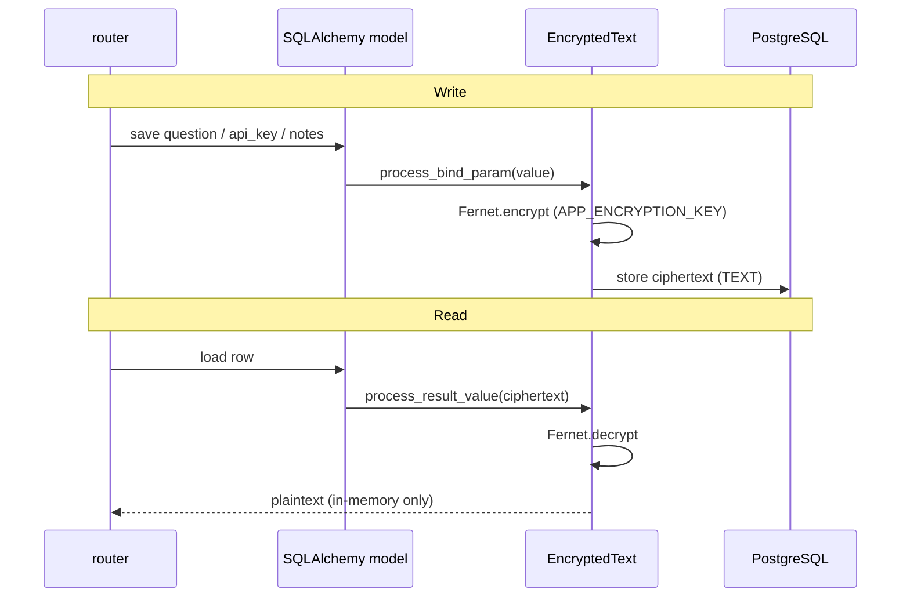
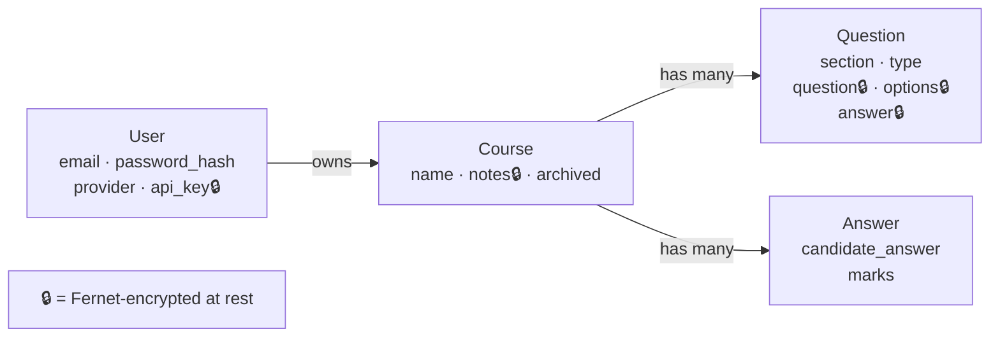

# Architecture

High-level view of InterviewPrep: the React frontend, the FastAPI + PostgreSQL
backend, and how they are packaged for Docker. Diagrams are UML rendered with
Mermaid (component, deployment, and sequence — no class-level detail).

The core idea is **one React UI, two backends**. The frontend picks its backend at
runtime from `window.IS_DESKTOP`:

- **Desktop** → single-user, data in `localStorage`, LLM called directly from the app.
- **Web** → multi-user FastAPI + PostgreSQL, data encrypted at rest, LLM proxied server-side.

## Component overview

**Notes**

- `api.js` is the single seam: view components never branch on mode themselves.
- On desktop the browser calls the provider directly; on web the request is proxied
  through `/api/generate` using the account's stored (encrypted) key.
- `EncryptedText` transparently encrypts sensitive columns on write and decrypts on
  read, so ciphertext is what actually rests in Postgres.

## Deployment (Docker Compose)

**Key properties**

- **Single exposed surface:** only the `app` container publishes a port (`8000`),
  serving both the UI and the API. **Postgres has no host port** — reachable only
  inside the compose network.
- **Multi-stage image:** a Node stage builds the React `dist/`; the Python stage
  copies it in as `static/` and runs FastAPI, so one image ships UI + API.
- **Secrets** (`JWT_SECRET`, `APP_ENCRYPTION_KEY`) come from `.env`; compose fails
  fast if unset. `APP_ENCRYPTION_KEY` must stay stable or encrypted data is lost.
- **State** lives in the `pgdata` volume.

Desktop apps are a separate deployment entirely — no containers, no backend; see
[DESKTOP.md](DESKTOP.md).

## Flow: register / login (web)

## Flow: generate a quiz / notes (web vs desktop)

## Flow: encryption at rest (web)

## Data model (high level)

Ownership, not columns — every record is scoped to a user.

## Mode selection at a glance

| Aspect | Desktop | Web (Docker) |
|--------|---------|--------------|
| Selector | `window.IS_DESKTOP = true` (Electron preload) | unset in browser |
| Backend facade | `backends/local.js` | `backends/remote.js` + `auth.js` |
| Storage | `localStorage` (per browser) | PostgreSQL (per user, encrypted) |
| Accounts | none | register / login (JWT) |
| LLM call | direct browser → provider | proxied via `/api/generate` |
| Auth modal | hidden | shown as landing |

## Related docs

- [DEVELOPMENT.md](DEVELOPMENT.md) — run and develop both modes.
- [DESKTOP.md](DESKTOP.md) — desktop packaging.
- [DOCKER.md](DOCKER.md) — hosting the web app.
- [backend/README.md](../backend/README.md) — endpoints, config, schema.
