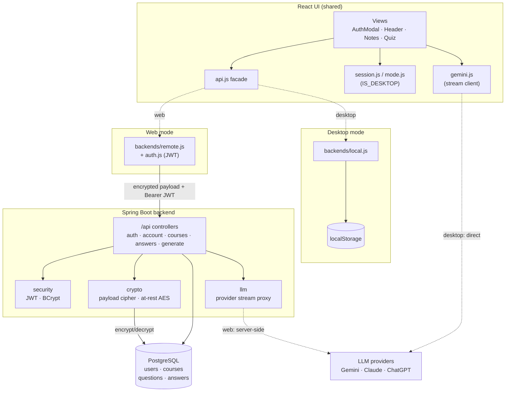
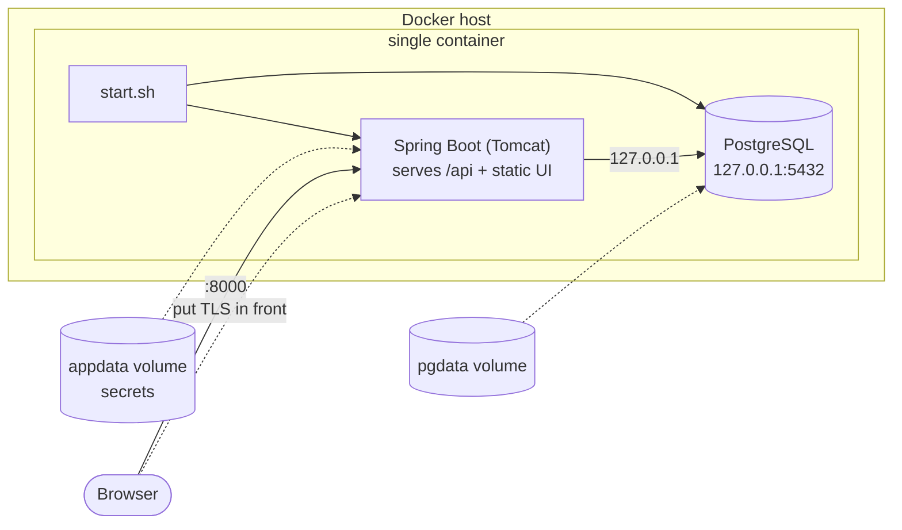
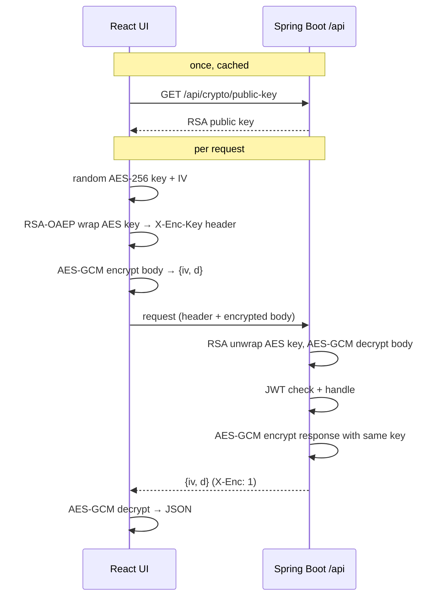
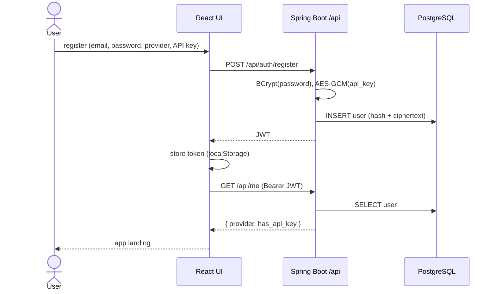
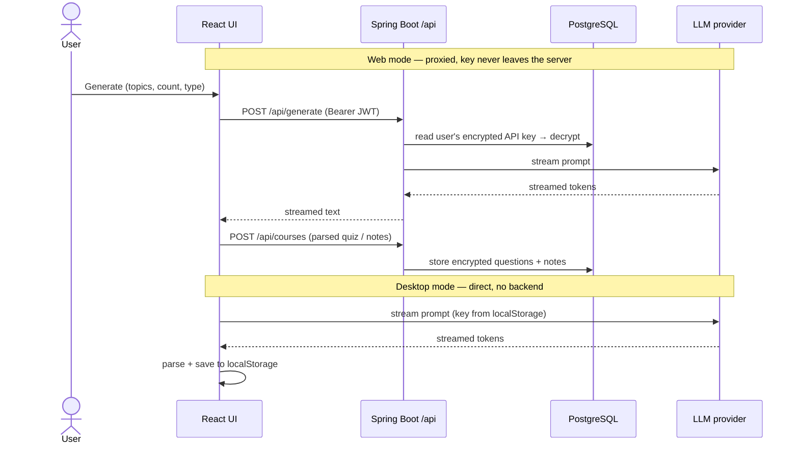
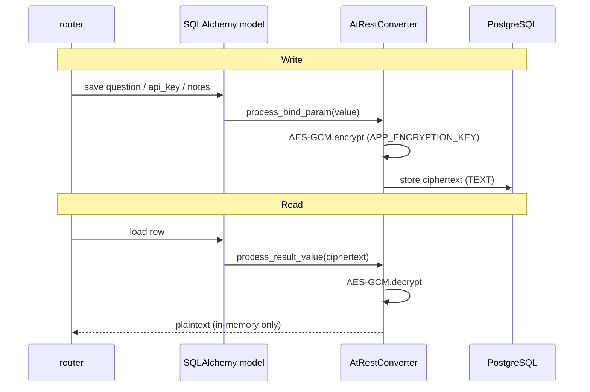
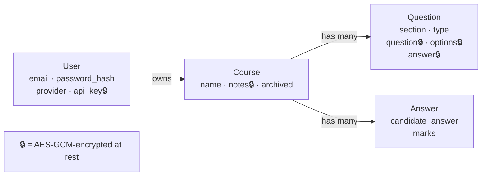

# Architecture

High-level view of InterviewPrep: the React frontend, the Spring Boot + PostgreSQL
backend, and how they are packaged for Docker. Diagrams are UML rendered with
Mermaid (component, deployment, and sequence — no class-level detail).

The core idea is **one React UI, two backends**. The frontend picks its backend at
runtime from `window.IS_DESKTOP`:

- **Desktop** → single-user, data in `localStorage`, LLM called directly from the app.
- **Web** → multi-user Spring Boot + PostgreSQL; data encrypted at rest **and** in transit; LLM proxied server-side.

## Component overview

**Notes**

- `api.js` is the single seam: view components never branch on mode themselves.
- On desktop the browser calls the provider directly; on web the request is proxied
  through `/api/generate` using the account's stored (encrypted) key.
- The at-rest JPA converter transparently AES-GCM-encrypts sensitive columns on
  write and decrypts on read, so ciphertext is what actually rests in Postgres.
- A payload cipher filter decrypts each request body (RSA-wrapped AES-GCM) and
  encrypts each response, so `/api` traffic is ciphertext even in the network tab.

## Deployment (Docker Compose)

**Key properties**

- **One container, one command:** PostgreSQL, the API, and the UI all run in a
  single image. `start.sh` boots Postgres on `127.0.0.1`, then launches the app.
  Only port `8000` is published.
- **Multi-stage image:** a Node stage builds the React `dist/`; a Zulu JDK stage
  builds the Spring Boot jar; the final Zulu JRE stage adds PostgreSQL, so one image
  ships DB + UI + API. State lives in the `pgdata` and `appdata` volumes.
- **Secrets** (`JWT_SECRET`, `APP_ENCRYPTION_KEY`) come from `.env`; compose fails
  fast if unset. `APP_ENCRYPTION_KEY` must stay stable or encrypted data is lost.
- **State** lives in the `pgdata` volume.

Desktop apps are a separate deployment entirely — no containers, no backend; see
[DESKTOP.md](DESKTOP.md).

## Flow: encrypted transport (every /api call)

Payloads are ciphertext on the wire — even the register body in the network tab.

The `/generate` stream reuses the same AES key, encrypting each streamed chunk
(`base64(iv‖ciphertext)` per line) so the live token stream stays confidential too.

## Flow: register / login (web)

## Flow: generate a quiz / notes (web vs desktop)

## Flow: encryption at rest (web)

## Data model (high level)

Ownership, not columns — every record is scoped to a user.

## Mode selection at a glance

| Aspect | Desktop | Web (Docker) |
|--------|---------|--------------|
| Selector | `window.IS_DESKTOP = true` (Electron preload) | unset in browser |
| Backend facade | `backends/local.js` | `backends/remote.js` + `auth.js` |
| Storage | `localStorage` (per browser) | PostgreSQL (per user, encrypted) |
| Accounts | none | register / login (JWT) |
| LLM call | direct browser → provider | proxied via `/api/generate` |
| Auth modal | hidden | shown as landing |

## Related docs

- [DEVELOPMENT.md](DEVELOPMENT.md) — run and develop both modes.
- [DESKTOP.md](DESKTOP.md) — desktop packaging.
- [DOCKER.md](DOCKER.md) — hosting the web app.
- [backend/README.md](../backend/README.md) — endpoints, config, schema.
